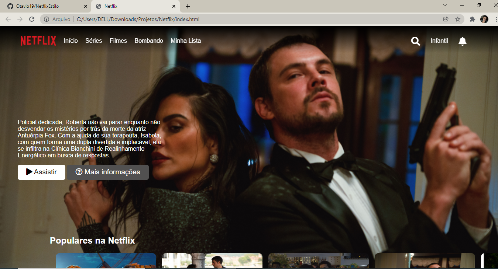
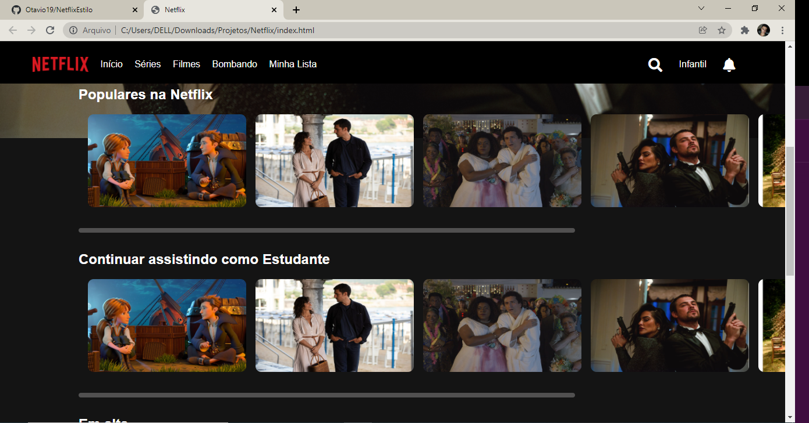
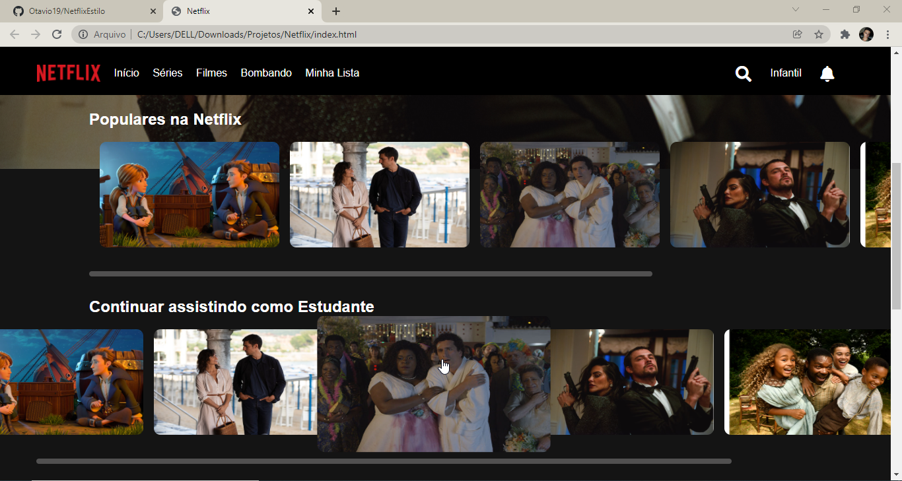
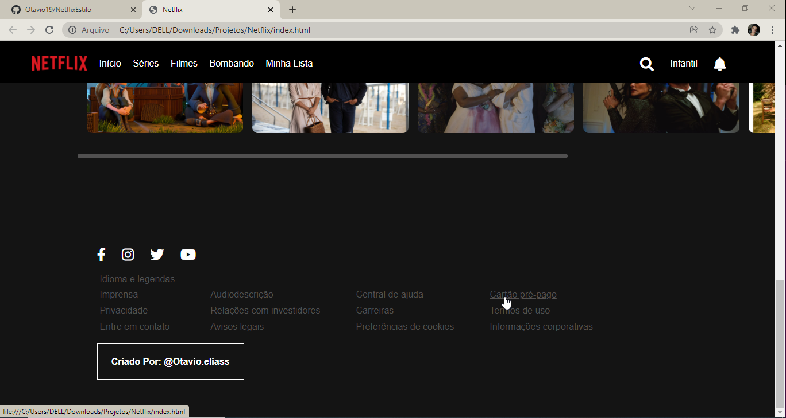

<h1>Netflix 🎞️ </h1>

Olá, tudo bem? Desde já agradeço por você querer ver essa minha cópia do site da <a href="https://Netflix.com">Netflix</a>, entendo que é pouco genérico o Jr. fazer esse site, más confesso que para mim é algo muito legal. Quando comecei a aprender o HTML comecei a reparar um pouco mais nos sites, e com certeza um dos sites que conheço hoje que eu mais gosto do Design é o da <a href="https://Netflix.com">Netflix</a>. Então montar um pequeno projeto, nem que seja apenas a HOME, me mostra o quanto evolui e sou muito grato por isso.

<h2>Imagens 📷</h2>

<h3>HOME</h3>

<h3>Categorias</h3>

OBS: Ao rolar um pouco o Scroll, o background do Menu altera.

<h3>Efeito Hover no Card</h3>

O card aumenta, e a fileira da categoria preenche 100% do espaço.

<h3>Efeito Hover no Card</h3>

 Nessa seção tem um pequeno Easter Egg

<h1>Obrigado!</h1>

Espero que tenha gostado.😃👍
 
